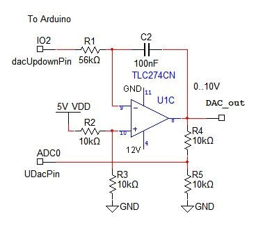

# vallox-esp
Control your Vallox ventilation system using an arduino.

## Introduction

This project extends the analog step switch VSS-P from Vallox, that is used to control a ventilation system like the [90 SC](http://www.vallox.com/files/412/KAHU90SC_D_280909.pdf).

It uses an arduino board with code to create a 10 bit DAC (Digital-Analog-Converter).

This way it's possible to create voltages between 0 and 10V, which controls how fast the fans of the ventilation system run. 

### Dependencies

The hardware consists of an Arduino Nano with an attached ENC28J60 ethernet shield, so the dependencies are as follows:

- [EthernetENC](https://github.com/JAndrassy/EthernetENC) for ENC28J60 support.
- [MQTT Client](https://pubsubclient.knolleary.net) to connect using mqtt.

The dependencies can be installed using the library manager in the Arduino IDE.

### Credits

This project is based on the [idea](http://www.hillier.de/lueftung.php) of Gernot Hillier.

For the arduino code of the 10 bit DAC see [here](http://www.avdweb.nl/arduino/hardware-interfacing/simple-10-bit-dac.html).
